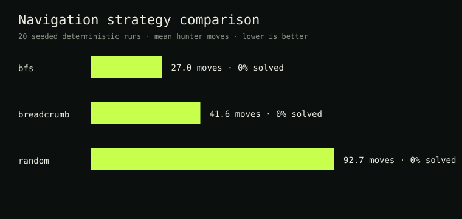
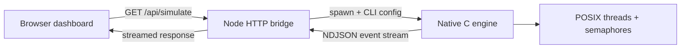

# Haunted Threads

> A live concurrency lab: a native C simulation with a browser dashboard,
> deterministic random streams, shortest-path navigation, and sanitizer-backed
> CI.



A multi-threaded C simulation inspired by *Phasmophobia* where hunters explore a haunted house to collect evidence and identify a ghost type.

## Overview

This project implements a concurrent simulation where multiple hunter threads navigate through a house while a ghost thread leaves evidence in rooms. Hunters must collect three pieces of matching evidence to solve the case while managing fear and boredom levels that can cause them to exit early.

### Key Features

- **Multi-threaded Architecture**: Separate POSIX threads for ghost and each hunter
- **Thread-Safe Synchronization**: Semaphores prevent race conditions on shared resources
- **Canonical Locking**: Deadlock-free room movement using address-ordered locking
- **Dynamic Memory Management**: Resizable hunter arrays and linked-list path stacks
- **Bitwise Evidence System**: Efficient evidence tracking using bit masks
- **Smart Pathfinding**: BFS algorithm for optimal return-to-van routing
- **Breadcrumb Navigation**: Stack-based path memory for exploration
- **Comprehensive Logging**: CSV-based activity logs for validation

## Project Structure

```
.
├── main.c              # Program entry point and thread orchestration
├── ghost.c             # Ghost behavior and autonomous movement
├── hunter.c            # Hunter AI with pathfinding and evidence gathering
├── house.c             # House structure and resource management
├── room.c              # Room operations and occupancy tracking
├── stack.c             # Linked-list stack for breadcrumb trails
├── helpers.c           # Logging, utilities, and thread-safe functions
├── defs.h              # Type definitions, structures, and constants
├── helpers.h           # Helper function declarations
├── test_suite.c        # Unit testing framework (bonus feature)
├── Makefile            # Build automation
└── README.md           # This file
```

## Requirements

### System Requirements
- Linux/Unix environment (tested on Ubuntu)
- GCC compiler with pthread support
- Make build tool
- Python 3 (for log validation)

### Optional Tools
- Valgrind (memory leak detection)
- ThreadSanitizer (race condition detection)
- CuTest framework (unit testing)

## Installation & Building

### Basic Compilation

```bash
# Clone or extract the project
tar -xvf 101345637_final_project.tar
cd ghost_hunter

# Build the executable
make

# Clean build artifacts
make clean
```

### Run Haunted Threads in the browser

Requires Node.js 22+.

```bash
make
node web/server.mjs
# open http://127.0.0.1:3000
```

If you prefer npm-style commands:

```bash
npm run build
npm run dev
```

The dashboard supports:

- animated movement across the connected Willow House graph;
- POSIX-thread and deterministic scheduler modes;
- BFS, breadcrumb, and random return navigation;
- custom teams of one to eight hunters;
- pause, resume, single-event stepping, restart, and playback speed controls;
- room-level evidence markers, separate fear/boredom meters, and an event timeline;
- keyboard navigation, reduced-motion preferences, and responsive layouts.
- a recruiter-friendly engineering showcase explaining native concurrency,
  canonical locking, BFS benchmarking, and the full-stack replay architecture.
- free template-based run explanations with recruiter, engineer, beginner,
  interviewer, and benchmark narration modes, plus optional local Ollama support.
- guest-mode simulations plus Clerk-backed private history, replay links, and
  JSON/CSV exports for signed-in users.
- owner-controlled public share links for recruiter-friendly replay demos.

Playback controls affect visualization only. They do not pause or reorder the
native engine; received events remain in their sequence-numbered queue.

### Full-stack session service

The Node service exposes a REST and Server-Sent Events API. Every simulation is
an isolated native process with cancellation and timeout handling. Signed-in
runs are saved to SQLite with the Clerk user id, allowing completed runs to use
the same SSE endpoint for private replay. Guest runs stream live but are not
stored after completion.

Saved runs are private by default. Signed-in owners can make selected completed
runs public, copy a `/share/:token` URL, and revoke that token later without
exposing the rest of their history.

Runtime data is stored in `data/haunted-threads.db` and excluded from Git. The
service requires Node.js 22 or newer for its built-in SQLite module.

Create a local `.env` from `.env.example` and paste Clerk keys there:

```dotenv
CLERK_PUBLISHABLE_KEY=pk_test_or_pk_live_from_clerk
CLERK_SECRET_KEY=sk_test_or_sk_live_from_clerk
CLERK_AUTHORIZED_PARTIES=http://127.0.0.1:3000,http://localhost:3000
```

`CLERK_SECRET_KEY` is reserved for future server-side Clerk API calls. Current
request protection verifies Clerk session JWTs using Clerk's public JWKS.

See [`docs/api.md`](docs/api.md) for endpoints and request examples.
For a project-demo deployment, use
[`docs/render-deployment.md`](docs/render-deployment.md) with
[`docs/production-checklist.md`](docs/production-checklist.md). The Oracle
Cloud VM alternative remains documented in
[`docs/oracle-cloud-deployment.md`](docs/oracle-cloud-deployment.md).
Production-ready templates live in [`deploy/`](deploy/).

### Thread Sanitizer Build

```bash
# Compile with ThreadSanitizer for race detection
make clean
make sanitize=tsan
```

## Usage

### Running the Simulation

```bash
./ghost_hunt --seed 42 --navigation bfs --hunters Ada,Grace,Linus
```

`--navigation` accepts `bfs`, `breadcrumb`, or `random`. Each entity owns a PRNG stream
derived from the displayed seed, so its decisions are reproducible. Thread
interleaving is intentionally left to the OS and can still change interactions;
that scheduling nondeterminism is part of the concurrency demo.

For byte-reproducible experiments, use the turn-based scheduler and export a
machine-readable summary:

```bash
./ghost_hunt --seed 42 --deterministic --tick-ms 0 \
  --navigation bfs --hunters Ada,Grace \
  --output-json run.json
```

The default remains real POSIX threads. Deterministic mode calls the same entity
step functions in a stable ghost-then-hunter order; it is an experimental
control mode, not a replacement implementation.

Long-running simulations can be bounded and accelerated:

```bash
./ghost_hunt --seed 42 --tick-ms 0 --max-ticks 500 --hunters Ada,Grace
```

Hunter names and numeric options are validated before any threads start.

Common shortcuts:

```bash
npm run test
npm run stress
npm run benchmark
```

### Interactive Setup

1. **Enable BFS Pathfinding** (Bonus Feature):
   ```
   Enable BFS Pathfinding for Hunter return? (1=Yes, 0=No/Default Stack): 1
   ```

2. **Add Hunters**:
   ```
   Enter hunter names (type 'done' when finished):
   Hunter name: Alice
   Hunter ID: 101
   Hunter name: Bob
   Hunter ID: 102
   Hunter name: done
   ```

3. The simulation runs automatically and displays results

### Sample Output

```
Ghost 68057 (poltergeist) initialized in Kitchen
Hunter 101 (Alice) initialized in Van with emf
Hunter 102 (Bob) initialized in Van with temp

[... simulation logs ...]

=== SIMULATION RESULTS ===
Ghost Type: poltergeist

Hunter Exit Reasons:
  Alice (ID 101): evidence
  Bob (ID 102): afraid

Evidence Collected: fingerprints, temperature, writing
Evidence matches ghost type: Yes
```

## Game Mechanics

### Ghost Behaviour

The ghost autonomously:
- Spawns in a random room
- Randomly moves, leaves evidence, or idles each cycle
- Drops one of three required evidence types when active
- Stays in rooms with hunters (resets boredom)
- Exits after 15 cycles of boredom (no hunters nearby)

### Hunter Behaviour

Hunters perform the following actions:
1. **Exploration Mode**: Navigate using least-visited room heuristic
2. **Evidence Gathering**: Collect evidence matching their device
3. **Device Swapping**: Exchange equipment in the Van
4. **Return to Van**: Navigate back when afraid, bored, or carrying evidence
5. **Exit**: Leave the simulation once back at the Van

### Evidence System

**Evidence Types** (7 total):
- EMF (Electromagnetic Field)
- Spirit Orbs
- Spirit Box Radio
- Temperature
- Fingerprints
- Ghost Writing
- Infrared

**Ghost Types** (8 total, each requires 3 specific evidence types):
- Poltergeist: Fingerprints + Temperature + Writing
- The Mimic: Fingerprints + Temperature + Radio
- Hantu: Fingerprints + Temperature + Orbs
- Jinn: Fingerprints + Temperature + EMF
- Phantom: Fingerprints + Infrared + Radio
- Banshee: Fingerprints + Infrared + Orbs
- Yurei: Temperature + Infrared + Orbs
- Mare: Writing + Radio + Orbs

### Exit Conditions

**Hunters exit when**:
- Fear reaches 15 (ghost encounters)
- Boredom reaches 15 (no ghost activity)
- Evidence collected and returned to Van
- 10% random chance after gathering evidence

**Ghost exits when**:
- Boredom reaches 15 (no hunter encounters)

## Technical Implementation

### Full-stack architecture



The Node bridge has no package dependencies. It streams events from the real C
binary, so the UI is an observability layer—not a JavaScript reimplementation.

### Verification

```bash
make test
make stress
make asan
make tsan
python3 scripts/benchmark.py
```

GitHub Actions runs unit tests, Address/UndefinedBehaviorSanitizer,
ThreadSanitizer, and Valgrind on pushes and pull requests. See
[`docs/locking.md`](docs/locking.md) for a visual explanation of canonical
locking.

The stress target runs 200 seeds across all three navigation strategies and
both scheduler modes with
per-process timeouts, followed by malformed CLI cases.

### Baseline navigation results

Across 20 matched deterministic seeds, BFS averaged **27.0 hunter moves**,
breadcrumbs averaged **41.6**, and random walking averaged **92.7**, with no
timeouts. BFS therefore used approximately 35% fewer movements than breadcrumbs
and 71% fewer than random navigation. See
[`benchmarks/README.md`](benchmarks/README.md) for methodology and raw artifacts.

Every streamed event includes a monotonically increasing `sequence` and a
microsecond timestamp. JSON summaries capture configuration, ghost metrics,
per-hunter ticks, movement, evidence, and exit reasons.

### Optional public AI layer

The clean integration point is a post-run **incident analyst**: send a bounded
summary of the event stream to an API and return an explanation of evidence,
contention, and navigation choices. Keep it behind a server-side endpoint with
rate limiting and an environment-held API key. The simulation must remain
fully usable without AI; this preserves the deterministic native engine and
avoids exposing credentials in the browser.

### Thread Safety

**Semaphores** protect:
- Room state (hunter lists, evidence, ghost presence)
- Shared case file (collected evidence)

**Canonical Locking**:
```c
// Lock rooms in consistent address order to prevent deadlocks
if (room1 > room2) {
    struct Room* temp = room1;
    room1 = room2;
    room2 = temp;
}
sem_wait(&room1->mutex);
sem_wait(&room2->mutex);
// ... perform operations ...
sem_post(&room2->mutex);
sem_post(&room1->mutex);
```

### Memory Management

**Dynamic Hunter Array**:
- Automatically resizes using `realloc()` when capacity reached
- Doubles capacity on each resize (amortized O(1) append)

**Breadcrumb Stack**:
- Linked-list implementation for path memory
- Nodes allocated/freed dynamically during push/pop
- Properly cleaned up in `stack_cleanup()`

### Pathfinding Algorithms

#### Stack-Based Navigation (Default)
- Pushes visited rooms onto stack during exploration
- Pops rooms in reverse order when returning to Van
- Simple but may not find shortest path

#### BFS Pathfinding (Bonus Feature)
- Calculates shortest path using breadth-first search
- Pre-computes entire route when return-to-van triggered
- Optimal path guarantee with O(V + E) complexity

**BFS Implementation**:
```c
static int bfs_path_find(struct Room* start_room, struct Room** path) {
    // Use predecessor array to track path
    // Reconstruct shortest route from Van back to start
    // Return path in forward order for navigation
}
```

### Bitwise Evidence Operations

**Storage**:
```c
typedef unsigned char EvidenceByte;

// Add evidence
case_file->collected |= EV_TEMPERATURE;

// Check for evidence
if (room->evidence & hunter->device) { /* found */ }

// Remove evidence
room->evidence &= ~device;
```

**Ghost Type Matching**:
```c
// Each ghost type is a bitmask of 3 evidence types
enum GhostType {
    GH_POLTERGEIST = EV_FINGERPRINTS | EV_TEMPERATURE | EV_WRITING,
    // ...
};

// Check if collected evidence matches any ghost type
bool is_case_solved(EvidenceByte collected) {
    // Compare against all 8 ghost type combinations
}
```

## Testing & Validation

### Memory Leak Detection

```bash
make clean
make
valgrind --leak-check=full --show-leak-kinds=all ./ghost_hunt
```

Expected output: `All heap blocks were freed -- no leaks are possible`

### Race Condition Detection

```bash
make clean
make sanitize=tsan
./ghost_hunt
```

ThreadSanitizer will report any data races detected

### Log Validation

```bash
python3 validate_logs.py
```

Validates:
- Timestamp ordering
- Entity state consistency
- Movement validity
- Evidence tracking

### Unit Testing (Bonus Feature)

```bash
# Compile with CuTest framework
gcc -o test_suite test_suite.c stack.c room.c hunter.c -lCuTest
./test_suite
```

Tests include:
- Stack LIFO behavior
- Room capacity enforcement
- Hunter movement heuristics
- BFS pathfinding correctness
- Evidence bitwise operations

## Algorithm Complexity

| Operation | Time Complexity | Space Complexity |
|-----------|----------------|------------------|
| Hunter Movement (Stack) | O(1) | O(d) - depth explored |
| Hunter Movement (BFS) | O(V + E) | O(V) - vertices visited |
| Evidence Check | O(1) | O(1) - bitwise operation |
| Room Lookup | O(1) | - |
| Ghost Type Match | O(G) - 8 types | O(1) |

## House Layout

Based on *Phasmophobia* Willow House:
- 13 rooms total
- Van (starting/exit point)
- 2-level structure (main floor + basement)
- Multiple pathways for strategic exploration

```
Van ── Hallway ┬── Master Bedroom
               ├── Boy's Bedroom
               ├── Bathroom
               ├── Basement ── Basement Hallway ┬── Right Storage
               │                                 └── Left Storage
               └── Kitchen ┬── Living Room
                          └── Garage ── Utility Room
```

## Known Limitations

- Maximum 8 hunters per room (configurable via `MAX_ROOM_OCCUPANCY`)
- Fixed house layout (not dynamically generated)
- No save/load game state functionality
- Console-only interface
- Single ghost instance per simulation

## Future Enhancements

- [ ] Dynamic house generation
- [ ] Multiple ghost types simultaneously
- [ ] Hunter-to-hunter communication
- [ ] Real-time visualization with NCurses
- [ ] Save/load simulation state
- [ ] Configurable difficulty levels
- [ ] Extended evidence types and ghost varieties
- [ ] Network multiplayer support

## Academic Information

**Course**: COMP 2401 - Introduction to Systems Programming  
**Institution**: Carleton University  
**Term**: Year 2, Semester 1  
**Student**: Nilay Sorathia (101345637)  
**Project**: Haunted Threads

## Learning Objectives Demonstrated

- ✅ POSIX thread creation and management
- ✅ Semaphore-based synchronization
- ✅ Deadlock prevention strategies
- ✅ Dynamic memory allocation
- ✅ Linked data structures (stacks)
- ✅ Bitwise operations for state management
- ✅ Graph traversal algorithms (BFS)
- ✅ File I/O and logging
- ✅ Modular C programming
- ✅ Unit testing and validation
- ✅ Makefile build automation
- ✅ Memory leak detection
- ✅ Race condition debugging

## Troubleshooting

**Compilation Errors**:
```bash
# Ensure pthread library is linked
gcc -pthread -o ghost_hunt *.c
```

**Segmentation Faults**:
- Run with Valgrind to identify memory errors
- Check semaphore initialization in all structures

**Deadlocks**:
- Verify canonical locking order is maintained
- Use ThreadSanitizer to detect lock-order inversions

**Hunters Not Moving**:
- Ensure rooms are properly connected in `house_populate_rooms()`
- Verify room capacity not exceeded

## Credits

- **Developer**: Nilay Sorathia
- **Course Instructor**: COMP 2401 Staff
- **Inspiration**: *Phasmophobia* by Kinetic Games
- **Testing Framework**: CuTest by Asim Jalis

## License

This project was created for academic purposes. All rights reserved.
