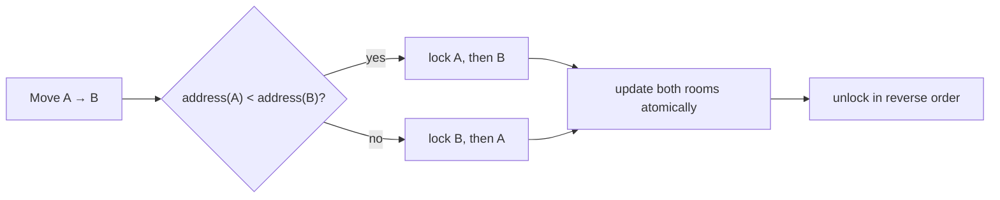

# Canonical locking and deadlock prevention

Every movement changes two shared rooms: the entity must leave one room and
enter another as one logical operation. Taking locks in travel order is unsafe:

```text
Hunter A: holds Kitchen, waits for Hallway
Hunter B: holds Hallway, waits for Kitchen
                          ↑ circular wait = deadlock
```

The simulation instead defines one global order using room addresses.



All threads acquire any pair in that same order. A circular wait is therefore
impossible: the edge between waiting threads can only point toward a
higher-addressed lock. This is the **canonical lock ordering** pattern.

The room helpers document whether the caller must already hold the room lock.
The case file has a separate lock because its evidence bitmask is independent
of room movement.
